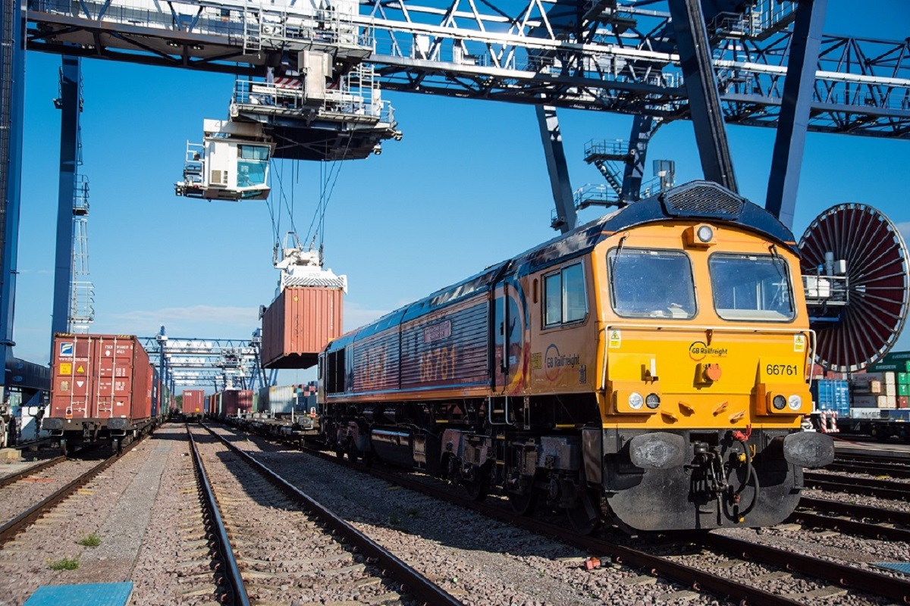
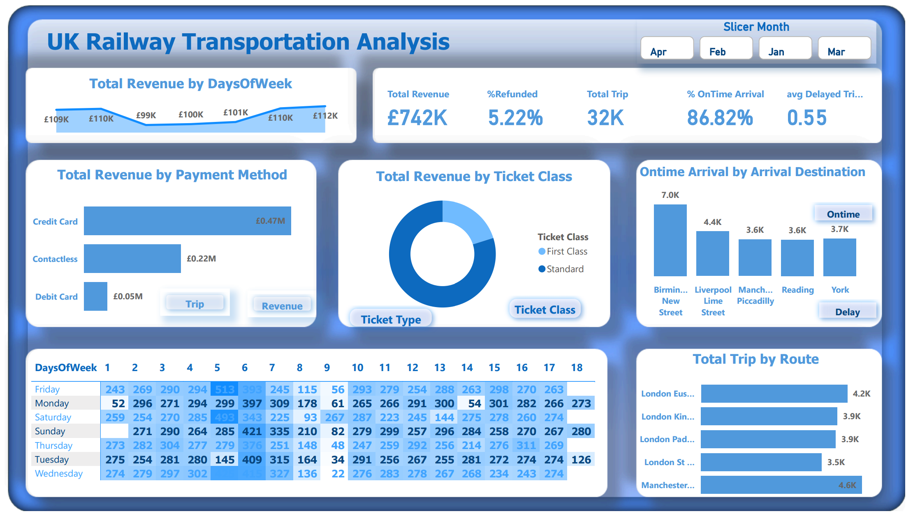

# UK Railway Transportation Analysis


***
## Introduction
The UK Railway Transportation Analysis project aims to provide insights into various aspects of railway operations, including revenue, trip performance, customer behavior, and more. By leveraging Power BI and DAX (Data Analysis Expressions), this project presents a detailed analysis to help stakeholders make informed decisions.

***
## Problem Statement
The UK Railway Transportation system faces challenges in optimizing revenue, managing customer satisfaction, ensuring on-time arrivals, and balancing the load across different routes and times. This project seeks to address these issues by providing actionable insights based on comprehensive data analysis.

***
## Project Scope

### 1. Total Revenue Analysis
- **Total Revenue**: £742K
- **Percentage Refunded**: 5.22%
- **Total Trips**: 32K
- **Percentage On-Time Arrival**: 86.82%
- **Average Delayed Trips**: 0.55

#### DAX Formulas:
```DAX
TotalRevenue = SUM(Transactions[Revenue])
PercentageRefunded = DIVIDE(SUM(Transactions[RefundedAmount]), SUM(Transactions[Revenue]))
TotalTrips = COUNT(Transactions[TripID])
PercentageOnTimeArrival = DIVIDE(CALCULATE(COUNT(Transactions[TripID]), Transactions[OnTime] = TRUE), COUNT(Transactions[TripID]))
AverageDelayedTrips = AVERAGE(Transactions[DelayTime])
```

### 1.Revenue by Payment Method
- **Credit Card**: £0.47M
- **Contactless**: £0.22M
- **Debit Card**: £0.05M

#### DAX Formulas:
```DAX
RevenueByPaymentMethod = SUMMARIZE(Transactions, Transactions[PaymentMethod], "TotalRevenue", SUM(Transactions[Revenue]))
```

### 3. Trip Revenue by Days of the Week
Analyze revenue generated from trips on different days of the week:

- **Friday**: High variability, notable peaks on certain dates.
- **Monday**: Consistently high with notable peaks.
- **Saturday**: High on specific dates, consistent otherwise.
- **Sunday**: Similar to Saturday, high on specific dates.
- **Thursday**: Stable with some peaks.
- **Tuesday**: Notable peaks, especially mid-month.
- **Wednesday**: Consistently high with a few notable lows.

#### DAX Formulas:
```DAX
TripRevenueByDaysOfWeek = SUMMARIZE(Transactions, Transactions[DayOfWeek], "TotalRevenue", SUM(Transactions[Revenue]))
```

### 4. Revenue by Ticket Class
- **First Class**
- **Standard Class**

#### DAX Formulas:
```DAX
RevenueByTicketClass = SUMMARIZE(Transactions, Transactions[TicketClass], "TotalRevenue", SUM(Transactions[Revenue]))
```

### 5. On-Time Arrival by Arrival Destination
- **Birmingham New Street**
- **Liverpool Lime Street**
- **Manchester Piccadilly**
- **Reading**
- **York**

#### DAX Formulas:
```DAX
OntimeArrivalByDestination = 
CALCULATETABLE(
    ADDCOLUMNS(
        VALUES(Transactions[ArrivalDestination]),
        "OntimeArrivalPercentage", 
        DIVIDE(CALCULATE(COUNTROWS(Transactions), Transactions[OnTime] = TRUE), COUNTROWS(Transactions))
    ),
    Transactions[ArrivalDestination] IN {"Birmingham New Street", "Liverpool Lime Street", "Manchester Piccadilly", "Reading", "York"}
)
```

### 6. Total Trip by Route
- **London Euston**
- **London King's Cross**
- **London Paddington**
- **London St Pancras**
- **Manchester**

#### DAX Formulas:
```DAX
TotalTripByRoute = 
SUMMARIZE(
    Transactions, 
    Transactions[Route], 
    "TotalTrips", 
    COUNT(Transactions[TripID])
)
```

### 7. On-Time vs Delay Analysis
Compare the on-time performance against delays across different routes and destinations.

#### DAX Formulas:
```DAX
OntimeVsDelay = 
SUMMARIZE(
    Transactions, 
    Transactions[Route], 
    "OntimeTrips", 
    CALCULATE(COUNT(Transactions[TripID]), Transactions[OnTime] = TRUE), 
    "DelayedTrips", 
    CALCULATE(COUNT(Transactions[TripID]), Transactions[OnTime] = FALSE)
)
```

### 8. Total Revenue by Days of the Week
Revenue distribution across the days of the week:

- **Monday**: £112K
- **Tuesday**: £99K
- **Wednesday**: £109K
- **Thursday**: £110K
- **Friday**: £100K
- **Saturday**: £110K
- **Sunday**: £101K

#### DAX Formulas:
```DAX
TotalRevenueByDaysOfWeek = 
SUMMARIZE(
    Transactions, 
    Transactions[DayOfWeek], 
    "TotalRevenue", 
    SUM(Transactions[Revenue])
)
```

***
## Dashboard


***
## Recommendations

1. **Improve Morning Services**:
   - Focus on improving the morning services as they have the highest transaction volume.

2. **Monthly Transaction Analysis**:
   - June, May, and April are high transaction months. Leverage these periods for promotional campaigns.

3. **Product Performance**:
   - **Top Products**: Maintain stock and promote Brewed Chai Tea, Gourmet Brewed Coffee, Barista Espresso, Brewed Black Tea, and Hot Chocolate.
   - **Least Products**: Investigate and promote Green Beans, Green Tea, House Blend Beans, Clothing, Organic Chocolate, and Drinking Chocolate.

4. **Store Location Performance**:
   - Assess and improve underperforming store locations while leveraging best practices from high-performing ones.

5. **Product Unit Price Analysis**:
   - Analyze and adjust prices to optimize sales without compromising profit margins.

***
Thank you for taking the time to explore this project. Your interest and attention are genuinely appreciated. If you have any contributions or suggestions, I welcome the opportunity to connect and discuss any ideas you may have. Feel free to reach out to me on [LinkedIn](https://www.linkedin.com/in/bestman-peter/). I would love to engage in a conversation and hear your thoughts. Looking forward to connecting!
